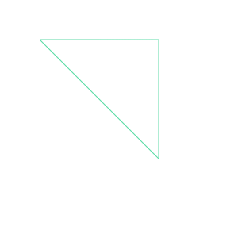

## canvas 元素
```
<canvas id="tutorial" width="300" height="300"></canvas>
```
默认 width 300px，height 150px

## 渲染上下文
`​<canvas>` 会创建一个固定大小的画布，会公开一个或多个渲染上下文(画笔)，使用渲染上下文来绘制和处理要展示的内容
```
const canvas = document.getElementById('tutorial')
const context = canvas.getContext('2d')
```

## 绘制形状

1. 栅格（grid）和空间坐标

  栅格起点为左上角，坐标为（0, 0）

  所有元素的位置都相对于原点来定位,如下图坐标为（x, y）
  

2. 绘制矩形
   
   只支持一种原生图形绘制：矩形；所有其他图形都至少需要生成一种路径（path）
   
   1. `fillRect(x, y, width, height)`：绘制一个填充的矩形。
   2. `strokeRect(x, y, width, height)`：绘制一个矩形的边框。
   3. `clearRect(x, y, widh, height)`：清除指定的矩形区域，然后这块区域会变的完全透明。
   4. `fillStyle = color` 设置图形的填充颜色
   4. `strokeStyle = color` 设置图形轮廓的颜色
   
   ```
   const draw = () => {
       const canvas = document.getElementById('canvas')
       const context = canvas.getContext('2d')
       // 画一个矩形
       context.fillStyle = '#5B8FF9' // 设置图形的填充颜色
       context.fillRect(10, 10, 100, 50)
   
       // 画一个矩形的边框
       context.lineWidth = 5 // 设置边框宽度
       context.strokeStyle = '#61DDAA' // 设置边框颜色
       context.strokeRect(10, 70, 100, 50)
   
       // 清除矩形区域
       context.clearRect(15, 15, 50, 25)
   }
   
   draw()
   ```
   
   

## 绘制路径

图形的基本元素是路径。

路径是通过不同颜色和宽度的线段或曲线相连形成的不同形状的点的集合。

一个路径，甚至一个子路径，都是闭合的。

使用路径绘制图形需要一些额外的步骤：

1. 创建路径起始点
2. 调用绘制方法去绘制出路径
3. 把路径封闭
4. 一旦路径生成，通过描边或填充路径区域来渲染图形

下面是需要用到的方法：

1. `beginPath()`

   新建一条路径，路径一旦创建成功，图形绘制命令被指向到路径上生成路径

2. `moveTo(x, y)`

   把画笔移动到指定的坐标`(x, y)`。相当于设置路径的起始点坐标。

3. `closePath()`

   闭合路径之后，图形绘制命令又重新指向到上下文中

4. `stroke()`

   通过线条来绘制图形边框

5. `fill()`

   通过填充路径的内容区域生成实心的图形

路径相关的方法：

1. ` lineTo(x, y) `

   绘制一条从当前位置到(x,y)位置的直线

2. `arcTo(x, y, radius, startAngle, endAngle, anticlockwise)`

   1. `x` 和 `y` 是圆心的坐标

   2. `radius` 是圆的半径

   3. `startAngle` 是圆弧开始的弧度。在Canvas中，0弧度是在正x轴（3点钟）上

   4. `endAngle` 是圆弧结束的弧度

   5. `anticlockwise` 是一个可选的布尔值，指定是否应该逆时针绘制圆弧。如果为 `true`，则逆时针绘制圆弧,默认顺时针。

   6. 角度转换弧度公式

      ```
      radians=(Math.PI/180)*degrees(角度值)   //角度转换成弧度
      即 Math.PI = 180°
      ```

      

**绘制线段**


```
// 绘制路径-直线
const draw = () => {
    const canvas = document.getElementById('canvas')
    const context = canvas.getContext('2d')

    context.strokeStyle = '#61DDAA' // 设置边框颜色

    context.beginPath() // 新建一条path
    context.moveTo(50, 50) // 把画笔移动到指定的坐标
    context.lineTo(200, 50) // 绘制一条从当前画笔坐标（50, 50）到（200, 50） 的直线
    context.closePath() // 闭合路径：会拉一条从当前点到path起始点的直线
    context.stroke() // 绘制路径
}
```

**绘制三角形边框**




```
// 绘制三角形边框
const draw = () => {
    const canvas = document.getElementById('canvas')
    const context = canvas.getContext('2d')

    context.strokeStyle = '#61DDAA' // 设置边框颜色

    context.beginPath() // 新建一条path
    context.moveTo(50, 50) // 把画笔移动到指定的坐标

    context.lineTo(200, 50)
    context.lineTo(200, 200)

    context.closePath() // 闭合路径：会拉一条从当前点到path起始点的直线
    context.stroke() // 绘制路径
}
```

**填充三角形**


```
const draw = () => {
    const canvas = document.getElementById('canvas')
    const context = canvas.getContext('2d')

    context.fillStyle = '#61DDAA'

    context.beginPath() // 新建一条path
    context.moveTo(50, 50) // 把画笔移动到指定的坐标

    context.lineTo(200, 50)
    context.lineTo(200, 200)

    context.closePath() // 闭合路径：会拉一条从当前点到path起始点的直线
    context.fill() // 填充闭合区域
}
```

**绘制圆弧**


```
const draw = () => {
    const canvas = document.getElementById('canvas')
    const context = canvas.getContext('2d')

    context.strokeStyle = '#61DDAA' // 设置边框颜色

    const centerX = canvas.width / 2 // 圆心x坐标
    const centerY = canvas.height / 2 // 圆心y坐标
    const radius = 100 // 半径
    const startAngle = 0 // 起始角度
    const endAngle = Math.PI * 2 // 结束角度，这里是完整的圆（2π弧度）

    // 绘制圆
    context.beginPath()
    context.arc(centerX, centerY, radius, startAngle, endAngle)
    context.lineWidth = 5 // 设置线条宽度
    context.stroke() // 绘制圆的边框
}
```


## 边框&填充&样式

**边框**

1. strokeStyle: 边框颜色
2. strokeRect：矩形边框
3. stroke：绘制路径边框

**填充**

1. fillStyle：填充颜色
2. fillRect：矩形填充
3. fill：绘制路径填充

**样式**

1. 线条宽度：lineWidth
2. 虚线：
   1. setLineDash([实线长度, 减息长度])
   2. lineDashOffset(number)：起始偏移量


```
const draw = () => {
    const canvas = document.getElementById('canvas')
    const context = canvas.getContext('2d')

    context.lineWidth = 5

    context.setLineDash([20, 5])
    context.lineDashOffset = -0

    context.strokeRect(50, 50, 150, 150)
}
```

## 绘制文字


```
const draw = () => {
    const canvas = document.getElementById('canvas')
    const context = canvas.getContext('2d')

    context.font = '50px sans-serif'
    context.textBaseline = 'center'

    context.fillText('HELLO', 0, 50)
    context.strokeText('天若有情', 0, 100)
}
```

## 绘制图片

```
context.drawImage(img, x, y, width, height)
x/y: 绘制的 img 在 canvas 中的坐标
width/height:控制 canvas 画入时应该缩放的大小
```


```
const draw = () => {
    const canvas = document.getElementById('canvas')
    const context = canvas.getContext('2d')
    const img = document.querySelector('img')
    const { width, height } = img
    context.drawImage(img, 0, 0, width / 2, height / 2)
}
document.querySelector('img').onload = () => {
    draw()
}
```

## 状态的保存和恢复

- `save()`用于保存 canvas 的当前状态，包括
  - 当前设置的变换矩阵（由 `translate()`, `rotate()`, `scale()`, `transform()`, 或 `setTransform()` 方法修改）
  - 当前的剪切区域（由 `beginPath()`, `moveTo()`, `lineTo()`, `clip()` 等方法设置）
  - 当前的样式设置，如：
    - `strokeStyle`
    - `fillStyle`
    - `globalAlpha`
    - `lineWidth`
    - `lineCap`
    - `lineJoin`
    - `miterLimit`
    - `font`
    - `textAlign`
    - `textBaseline`
    - `shadowOffsetX`
    - `shadowOffsetY`
    - `shadowBlur`
    - `shadowColor`
    - `globalCompositeOperation`
    - 等等...
- `restore()` 方法用于恢复之前由 `save()` 方法保存的Canvas状态


```
const draw = () => {
    const canvas = document.getElementById('canvas')
    const context = canvas.getContext('2d')

    // 保存当前状态
    context.save()

    // 设置一些样式和变换
    context.fillStyle = 'red'
    context.translate(50, 50)

    // 绘制一个矩形
    context.fillRect(0, 0, 100, 100) // 这个矩形会在(50, 50)的位置，颜色是红色

    // 恢复之前保存的状态
    context.restore()

    // 再次绘制一个矩形，但这次它会在原始位置（0,0），且颜色可能是之前的状态（如果之前设置过的话）
    context.fillRect(0, 0, 100, 100) // 这个矩形会在(0, 0)的位置，颜色取决于restore()之前的设置
}
```

