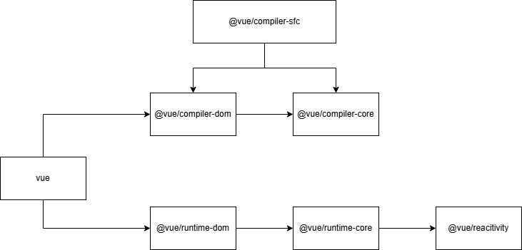
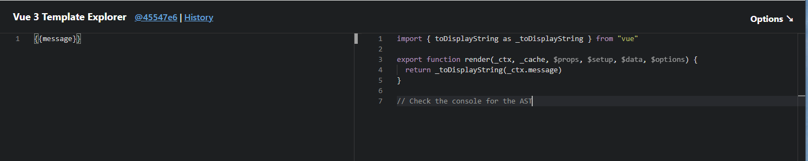

## 架构

## 编译模块

实时编译：https://template-explorer.vuejs.org/#eyJzcmMiOiJ7e21lc3NhZ2V9fSIsIm9wdGlvbnMiOnt9fQ==

### @vue/compiler-sfc：单文件组件（SFC）编译

负责解析 `.vue` 文件（单文件组件），将其拆分为模板（template）、脚本（script）、样式（style）三部分，并分别处理。

- 核心功能
  - 解析 SFC 语法，提取 template、script、style 块。
  - 处理 `<script setup>` 语法糖（编译为普通 setup 函数）。
  - 样式作用域（scoped）处理（添加属性选择器）。
  - 样式预处理器（less/sass）的集成支持。
  - 生成组件的最终代码（组合 template 和 script）。

###  @vue/compiler-dom：浏览器编译扩展

基于 `@vue/compiler-core`，针对浏览器环境的模板编译扩展。

- 核心功能
  - 处理浏览器特有的模板语法（如 `v-html`、`v-text` 等 DOM 相关指令）。
  - 解析 HTML 标签、属性的特殊逻辑（如 SVG 标签处理）。
  - 生成适配浏览器运行时的 `render` 函数。

### @vue/compiler-core：编译核心

模板编译的核心模块，与平台无关，负责将模板解析为抽象语法树（AST），并生成渲染函数（`render`）。

- 核心功能
  - 模板解析（将字符串模板转为 AST）。
  - AST 转换（优化处理，如静态节点标记）。
  - 代码生成（将 AST 转为可执行的 `render` 函数代码）。
  - 编译选项处理（如 `delimiters` 自定义分隔符）。

## 运行时模块

### @vue/runtime-dom：浏览器运行时

基于 `@vue/runtime-core` 扩展，针对浏览器环境的运行时实现。

- 核心功能
  - 浏览器特有的节点操作（DOM 创建、插入、删除等）。
  - 事件绑定（处理浏览器事件兼容，如 `click`、`input`）。
  - 样式处理（`class`、`style` 绑定的 DOM 映射）。
  - 浏览器内置指令（`v-show` 基于 DOM 实现）。
  - 提供 `createApp` 入口方法（创建应用实例）。

### @vue/runtime-core：运行时核心

Vue3 最核心的模块，包含了 Vue 运行时的核心逻辑，与平台无关（浏览器、Node 等）。

- 核心功能
  - 组件实例化（`Component`、`setup` 函数处理）。
  - 响应式系统的集成（依赖收集、触发更新）。
  - 虚拟 DOM（VNode）的创建、挂载、更新、卸载逻辑。
  - 生命周期钩子的管理（`onMounted`、`onUpdated` 等）。
  - 事件处理、Props 传递、插槽（Slots）处理。
  - 依赖注入（`provide/inject`）实现。
- **地位**：其他平台相关的运行时（如浏览器）都基于此扩展。

## 响应式模块

### @vue/reactivity：响应式系统

独立的响应式模块，可脱离 Vue 核心单独使用（如用于状态管理）。

- 核心功能
  - 基于 Proxy 的响应式对象创建（`reactive`、`ref`、`shallowRef` 等）。
  - 依赖收集（`track` 函数）和触发更新（`trigger` 函数）。
  - 计算属性（`computed`）和侦听器（`watch`）的实现。
  - 响应式对象的嵌套处理、只读 / 浅响应等特性。

### 

### 