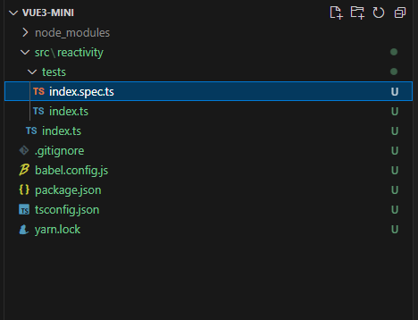
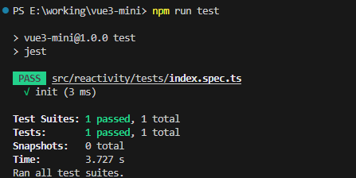

## 目录结构



## 项目初始化

1. 安装 yarn

```
npm i yarn -g
```

2. 初始化项目

```
yarn init -y
```

3. node 版本

**20.14.0**

## 安装 jest

1. 安装 ts

```
yarn add typescript --dev
```

2. 初始化 ts config

```
npx tsc -- init

// tsconfig.js 
"types": ["jest"] // 用于指定 TypeScript 包含哪些类型声明文件（.d.ts文件）
```

3. 安装 jest 及其 ts 类型文件

```
 yarn add jest @types/jest --dev
```

4. 配置 jest 使用 esm 模块

```
// 配置支持 jest
yarn add --dev babel-jest @babel/core @babel/preset-env

// 配置支持 typescript
yarn add --dev @babel/preset-typescript

// babel.config.js
module.exports = {
    presets: [
        [
            '@babel/preset-env',
            {
                targets: { node: 'current' }
            }
        ],
        '@babel/preset-typescript'
    ]
}
```


## 测试

1. tests/index.ts

```
export function add(a:any, b:any) {
    return a + b
}
```

2. index.spec.ts

```
import { add } from "./index"

it('init', () => {
    expect(add(1, 2)).toBe(3)
})
```

3. package.json

```
"scripts": {
    "test": "jest"
  }
```

4. 运行

```
npm run test
```

