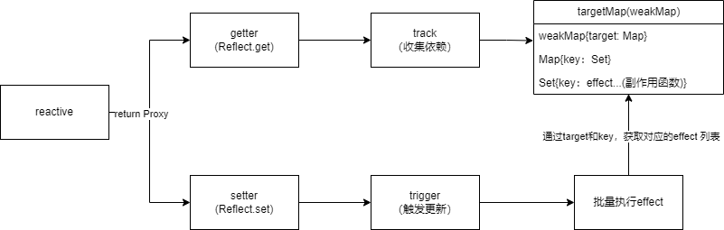
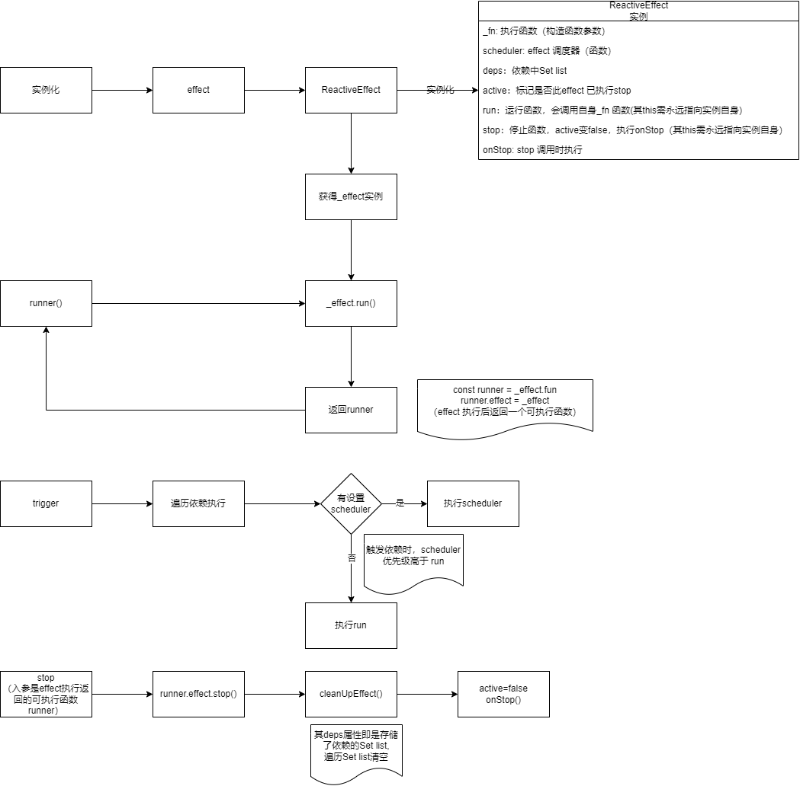
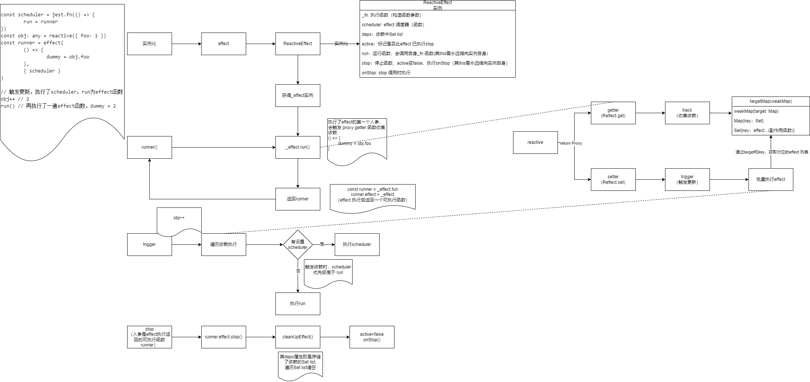

## 概述

1. 依赖收集



2. effect 函数



3. 响应式原理



## reactive

1. `reactive.ts`

   入口文件，返回 proxy 实例，通过 引入的 handlers 生成getter 和 setter

```
import { mutableHandlers, readonlyHandlers } from './baseHandlers'

export function reactive(raw: object) {
    return createActiveObject(raw, mutableHandlers)
}

export function readonly(raw: object) {
    return createActiveObject(raw, readonlyHandlers)
}

function createActiveObject(raw: object, baseHandlers: any) {
    return new Proxy(raw, baseHandlers)
}

```

2. `baseHandlers.ts`
   1. 封装柯里化函数`createGeter`和`createSetter`，调用生成 `getter` 和 `setter`
   2. 在 `getter` 中通过`track`收集依赖，在 `setter`中通过`trigger`触发更新

```
import { track, trigger } from './effect'

// reactive getter 和 setter
const get = createGetter()
const set = createSetter()

// readonly getter
const readonlyGet = createGetter(true)

/**
 * 生成 getter 函数
 * @param isReadonly boolean 是否仅读的
 * @returns {Function}
 */
function createGetter(isReadonly = false) {
    return function get(target: object, key: string | symbol) {
        const res = Reflect.get(target, key)

        if (!isReadonly) {
            // 收集依赖
            track(target, key)
        }

        return res
    }
}

/**
 * 生成 setter 函数
 * @returns
 */
function createSetter() {
    return function set(target: object, key: string | symbol, value: any) {
        const res = Reflect.set(target, key, value)
        // 触发更新
        trigger(target, key)
        return res
    }
}

//  reactive proxy handler
export const mutableHandlers = {
    get,
    set
}

// reaonly proxy handler
export const readonlyHandlers = {
    get: readonlyGet,
    set(target: object, key: string, value: any) {
        console.warn(`key:${key} set failed because target is readonly`, target)
        return true
    }
}

```

## effect 副作用函数(effect.ts)
1. `track` 函数，用于收集依赖, 其数据结构如下
   1. `weakMap{target: Map}`
   2. `Map{key: Set}`
   3. `Set{key: effect1, key: effect2}`
2. `trigger `函数，用于触发更新
3. `activeEffect`: 最新执行 run 函数的`ReactiveEffect` 的实例 
4. `effect` 函数，其具有以下特点
   1. 首次会执行传入的第一个参数函数，并返回一个可执行函数
   2. 当响应对象setter触发更新的时候，effect 会再次执行（优先取调度器函数执行，没有则取第一个参数的函数执行）
   3. 其执行会生成一个` ReactiveEffect` 实例，通过该实例进行交互
      1. `_fn`: `effect `函数第一个参，首次通过实例 `run` 函数执行一次
      2. `scheduler`: 调度器，在setter触发依赖重新取出依赖执行时，优先执行调度器
      3. `deps:` 对应 `tarck` 收集依赖的 Set list, 会在调用stop 时清空依赖
      4. `active:` 标识是否还是活跃的（未调用`stop`停止`effect`的）
      5. `stop`: 对 `deps` 的 `Set list` 进行清空
      6. `onStop`: `stop` 的回调函数
```
import { extend } from '../shared'

// 收集依赖的 weakMap 对象
const targetMap = new WeakMap()
// 当前的 effect
let activeEffect: any

/**
 * 收集依赖,由proxy对象getter触发，构建的数据如下：
 * weakMap{target: Map}
 * Map{key: Set}
 * Set{key: effect1, key: effect2}
 * @param target proxy 对象
 * @param key proxy 对象 key
 */
export function track(target: object, key: string | symbol) {
    let depsMap = targetMap.get(target)
    if (!depsMap) {
        depsMap = new Map()
        targetMap.set(target, depsMap)
    }
    let dep = depsMap.get(key)
    if (!dep) {
        dep = new Set()
        depsMap.set(key, dep)
    }

    if (!activeEffect) return

    dep.add(activeEffect)
    // activeEffect 的 deps 收集 dep
    activeEffect.deps.push(dep)
}

/**
 * 触发依赖，由proxy对象setter触发
 * 从 targetMap 中取出收集的依赖（effect 函数），进行执行
 * @param target proxy 对象
 * @param key proxy 对象 key
 */
export function trigger(target: object, key: string | symbol) {
    let depsMap = targetMap.get(target)
    let dep = depsMap.get(key)

    for (const effect of dep) {
        // 如果effect 有设置 sceduler,则执行scheduler，否则执行effect
        if (effect.scheduler) {
            effect.scheduler()
        } else {
            effect.run()
        }
    }
}

export function effect(fn: Function, options: any = {}) {
    const _effect = new ReactiveEffect(fn, options.scheduler)
    // 融合所有属性
    extend(_effect, options)

    _effect.run()

    // 优化前： _effect.run.bind(_effect) 以当前ReactiveEffect实例作为this指向，并返回该effect可执行函数
    // 优化后：定义处使用了箭头函数，无需指定绑定
    const runner: any = _effect.run
    runner.effect = _effect

    return runner
}

type Scheduler = (...args: any[]) => void
class ReactiveEffect {
    private _fn: Function // effect 执行函数
    public scheduler?: Scheduler // effect 调度器
    deps = [] //
    active = true
    onStop?: () => void

    constructor(fn: Function, scheduler: Scheduler) {
        this._fn = fn
        this.scheduler = scheduler
    }

    // 使用箭头函数优化，其指向会绑定在ReactiveEffect实例上
    run = () => {
        activeEffect = this
        return this._fn()
    }
    /* run() {
        activeEffect = this
        return this._fn()
    } */

    stop = () => {
        if (this.active) {
            cleanUpEffect(this)
            this.active = false
            if (this.onStop) {
                this.onStop()
            }
        }
    }
}

// 清空 effect
function cleanUpEffect(effect: any) {
    effect.deps.forEach((dep: any) => {
        dep.delete(effect)
    })
}

// 停止 effect
export function stop(runner: any) {
    runner.effect.stop()
}

```

## 测试
1. `reactive.spec.ts`
  1. 代理对象与原对象非同一个对象
  2. 可以正常通过代理对象获取值
```
import { reactive } from '../reactive'

describe('effect', () => {
    it('happy path', () => {
        const original = {
            foo: 1
        }
        type observedType = typeof original
        const observed = reactive(original) as observedType

        expect(observed).not.toBe(original)
        expect(observed.foo).toBe(1)
    })
})
```
2. `effect.spec.ts`
    1. 验证 effect 立即调用第一个参数执行
    2. 验证 effect 调用第一个参数执行后，返回一个可执行的函数
    3. 验证 setter 触发更新后优先调用调度器函数
    4. 验证 stop 函数可停止 effect 的副作用（清空依赖与函数的关联）
    5. 验证 stop 函数调用后会触发 onStop
```
import { effect, stop } from '../effect'
import { reactive } from '../reactive'

describe('effect', () => {
    // 验证effect 与依赖收集&触发更新
    it('happy path', () => {
        const user: any = reactive({
            age: 10
        })
        let nextAge
        effect(() => {
            nextAge = user.age + 1
        })
        expect(nextAge).toBe(11)

        // update
        user.age++
        expect(nextAge).toBe(12)
    })

    // 验证 effect 指向应该要返回一个可执行函数
    it('should return runner when call effect', () => {
        let foo = 10
        const runner = effect(() => {
            foo++
            return 'effect_foo'
        })
        expect(foo).toBe(11)
        const r = runner()
        expect(foo).toBe(12)
        expect(r).toBe('effect_foo')
    })
    // 验证 effect 的 scheduler(调度器)
    // 1. 通过 effect 的第二个参数指定一个 scheduler(函数)
    // 2. effect 第一次执行的时候，会立即执行其第一个参数 fn
    // 3. 当响应式对象 setter 触发更新时候，如果有指定 scheduler, 执行 scheduler, 否则执行fn
    // 4. 当执行runner(effect执行的返回的可执行函数)，会再次执行effect 第一个参数 fn
    it('scheduler', () => {
        let dummy
        let run: any
        const scheduler = jest.fn(() => {
            run = runner
        })
        const obj: any = reactive({ foo: 1 })
        const runner = effect(
            () => {
                dummy = obj.foo
            },
            { scheduler }
        )

        // 期望effect 首次执行，scheduler 不会被执行
        expect(scheduler).not.toHaveBeenCalled()
        // 期望effect 首次执行 fn
        expect(dummy).toBe(1)

        // 期望 setter 触发更新的时候，执行 scheduler
        obj.foo++
        expect(scheduler).toHaveBeenCalledTimes(1)
        expect(dummy).toBe(1)

        run()
        expect(dummy).toBe(2)
    })

    it('stop', () => {
        let dummy
        const obj: any = reactive({ prop: 1 })
        const runner = effect(() => {
            dummy = obj.prop
        })
        obj.prop = 2
        expect(dummy).toBe(2)
        stop(runner)
        obj.prop = 3
        expect(dummy).toBe(2)

        // stopped effect sholud still be manually callable
        runner()
        expect(dummy).toBe(3)
    })

    it('onStop', () => {
        const obj: any = reactive({
            foo: 1
        })
        const onStop = jest.fn()
        let dummy
        const runner = effect(
            () => {
                dummy = obj.foo
            },
            {
                onStop
            }
        )
        stop(runner)
        expect(onStop).toHaveBeenCalledTimes(1)
    })
})
```

3. readonly.spec.ts
    1. 验证 `readonly`可正常访问属性
    2. 验证 `readonly` 代理对象设置值会触发警告 
```
import { readonly } from '../reactive'

describe('readonly', () => {
    it('happy path', () => {
        const original = {
            foo: 1,
            bar: {
                baz: 2
            }
        }
        const wrapped: any = readonly(original)
        expect(wrapped).not.toBe(original)
        expect(wrapped.foo).toBe(1)
    })

    it('warn when call set', () => {
        console.warn = jest.fn()
        const user: any = readonly({
            age: 10
        })
        user.age = 11

        expect(console.warn).toHaveBeenCalled()
    })
})

```