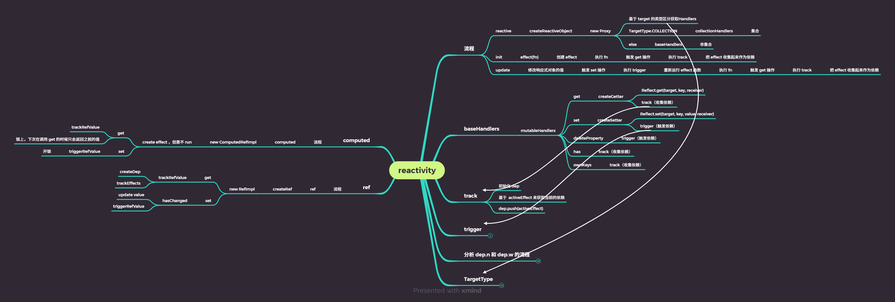
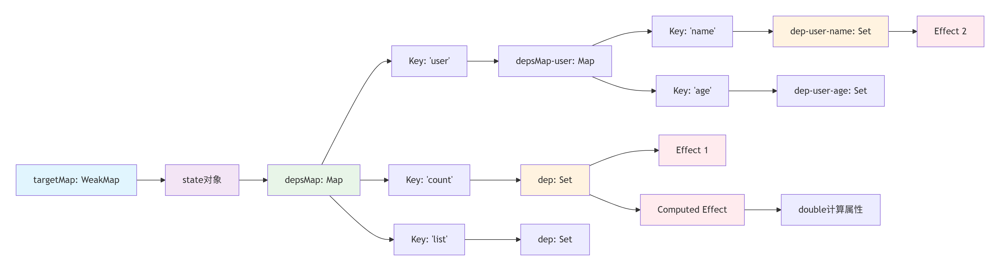

## 调用流程图



## reactive

### 基本功能特性

1. **基本响应式**： reactive 将普通对象包装为代理，返回值不等于原对象。
2. **深度响应式**：嵌套对象自动变为响应式
3. **使用特点**:
   1. **数组支持完善**：数组操作完全响应式
   2. **集合类型支持**：Map、Set 等也支持响应式
   3. **属性检测全面**：可检测属性添加/删除


### 测试用例

1. 验证了普通对象包装为代理，返回值不等于原对象。
2. 验证了嵌套对象自动变为响应式
3. 数组操作完全响应式、Map、Set 等也支持响应式、可检测属性添加/删除未验证，这里只实现最基础的。

```
// packages\reactivity\__tests__\reactive.spec.ts

import { reactive, isReactive, toRaw } from "../src/reactive";
describe("reactive", () => {
  test("Object", () => {
    const original = { foo: 1 };
    const observed = reactive(original);
    expect(observed).not.toBe(original);
    expect(isReactive(observed)).toBe(true);
    expect(isReactive(original)).toBe(false);
    // get
    expect(observed.foo).toBe(1);
    //     // has
    expect("foo" in observed).toBe(true);
    //     // ownKeys
    expect(Object.keys(observed)).toEqual(["foo"]);
  });

  test("nested reactives", () => {
    const original = {
      nested: {
        foo: 1,
      },
      array: [{ bar: 2 }],
    };
    const observed = reactive(original);
    expect(isReactive(observed.nested)).toBe(true);
    expect(isReactive(observed.array)).toBe(true);
    expect(isReactive(observed.array[0])).toBe(true);
  });

  test("toRaw", () => {
    const original = { foo: 1 };
    const observed = reactive(original);
    expect(toRaw(observed)).toBe(original);
    expect(toRaw(original)).toBe(original);
  });
});
```

### 关键实现—对象代理

1. 创建WeakMap 变量：reactiveMap，用于收集依赖

   1. 为何使用 WeakMap

      1. weakMap 的建必须是对象

      ```
      const weakMap = new WeakMap()
      
      const obj = {}
      weakMap.set(obj, '依赖集合') // ✅ 正确 - 键是对象
      
      // ❌ 错误 - 键不能是基本类型
      weakMap.set(123, 'value')     // TypeError
      ```

      2. 弱引用

      ```
      let target = { data: 'test' }
      const weakMap = new WeakMap()
      weakMap.set(target, { deps: new Set() })
      
      // 当 target 不再被引用时...
      target = null // 解除引用
      
      // WeakMap 中的键值对会被垃圾回收自动清理
      // 不需要手动删除，避免内存泄漏
      ```

   2. 收集依赖的数据结构

      - weakMap => 响应式对象: Map
      - Map => 响应式对象-key: Set
      - Set: [副作用函数]

      ```
      const state = reactive({
        count: 0,
        user: { name: 'Alice', age: 25 },
        list: [1, 2, 3]
      })
      
      // Effect 1: 监听 count
      effect(() => console.log('Count:', state.count))
      
      // Effect 2: 监听 user.name  
      watch(() => state.user.name, (name) => console.log('Name:', name))
      
      // Effect 3: 计算属性
      const double = computed(() => state.count * 2)
      ```

      

      ```
      targetMap (WeakMap)
      │
      ├── 响应式对象1 (state)
      │   └── depsMap (Map)
      │       ├── key: "count"
      │       │   └── dep (Set)
      │       │       ├── Effect 1 (console.log)
      │       │       └── Effect 2 (computed)
      │       │
      │       ├── key: "user"
      │       │   └── depsMap-user (Map)
      │       │       ├── key: "name"
      │       │       │   └── dep-user-name (Set)
      │       │       │       └── Effect 3 (watch)
      │       │       │
      │       │       └── key: "age"
      │       │           └── dep-user-age (Set)
      │       │
      │       └── key: "list"
      │           └── dep-list (Set)
      │
      ├── 响应式对象2 (另一个state)
      │   └── depsMap (Map)
      │       └── ...
      │
      └── 响应式对象3 (全局状态)
          └── depsMap (Map)
              └── ...
      ```

2. 通过 createReactiveObject 进行了代理

   1. 缓存优化：通过在 reactiveMap中如果查到目标对象已经设置了代理，则无需再次代理，直接返回代理对象
   2. 利用 Proxy 对目标对象进行代理，并存入reactiveMap 中，返回代理对象

3. 代理对象中参数设置=》mutableHandlers

   1. getter

      1. 参数：(target、property、receiver)
         1. target 目标对象（原来未被代理对象）
         2. property 被获取的属性名
         3. receiver Proxy 或基础 Proxy 的对象
      2. 通过 Reflect.get(target, property , receiver) 获取到对象的值
      3. **通过 track 函数进行依赖的收集**
      4. 如果返回的值还是对象，则对其进行再次代理：reactive(res)
      5. 返回获取到的值

   2. setter

      1. 参数：(target、property、value、receiver)
         1. target 目标对象（原来未被代理对象）
         2. property 被获取的属性名
         3. value 新属性值
         4. receiver Proxy 或基础 Proxy 的对象
      2. **通过 Reflect.set(target, property , value, receiver) 设置值**
      3. **通过trigger(target, "set", property ) 触发依赖**

   3. 最完整的参数设置（拦截属性删除、拦截 in 操作符、拦截Object.kes()等操作）

      ```
      deleteProperty(target, key) {
          const hadKey = Object.prototype.hasOwnProperty.call(target, key)
          const result = Reflect.deleteProperty(target, key)
      
          if (hadKey && result) {
          	trigger(target, key, 'delete') // 触发删除操作
          }
          return result
      },
        
      // 拦截 in 操作符
      has(target, key) {
        track(target, key)
        return Reflect.has(target, key)
      },
      
      // 拦截 Object.keys() 等操作
      ownKeys(target) {
      	track(target, 'iterable') // 追踪迭代操作
      	return Reflect.ownKeys(target)
      }
      ```

   4. 为何需要使用闭包？

      1. 用于设置是否是 readonly、shallowReactive
      2. 用于实现 isReactive

```
// packages\reactivity\src\reactive.ts

export const reactiveMap = new WeakMap();

import {
  mutableHandlers
} from "./baseHandlers";

export function reactive(target) {
  return createReactiveObject(target, reactiveMap, mutableHandlers);
}

function createReactiveObject(target, proxyMap, baseHandlers) {
  // 核心就是 proxy
  // 目的是可以侦听到用户 get 或者 set 的动作

  // 如果命中的话就直接返回就好了
  // 使用缓存做的优化点
  const existingProxy = proxyMap.get(target);
  if (existingProxy) {
    return existingProxy;
  }

  const proxy = new Proxy(target, baseHandlers);

  // 把创建好的 proxy 给存起来，
  proxyMap.set(target, proxy);
  return proxy;
}

```

```
// packages\reactivity\src\baseHandlers.ts

const get = createGetter();
const set = createSetter();

export const mutableHandlers = {
  get,
  set,
};

function createGetter(isReadonly = false, shallow = false) {
  return function get(target, key, receiver) {
    const isExistInReactiveMap = () =>
      key === ReactiveFlags.RAW && receiver === reactiveMap.get(target);

    const isExistInReadonlyMap = () =>
      key === ReactiveFlags.RAW && receiver === readonlyMap.get(target);

    const isExistInShallowReadonlyMap = () =>
      key === ReactiveFlags.RAW && receiver === shallowReadonlyMap.get(target);

    if (key === ReactiveFlags.IS_REACTIVE) {
      return !isReadonly;
    } else if (key === ReactiveFlags.IS_READONLY) {
      return isReadonly;
    } else if (
      isExistInReactiveMap() ||
      isExistInReadonlyMap() ||
      isExistInShallowReadonlyMap()
    ) {
      return target;
    }

    const res = Reflect.get(target, key, receiver);

    // 问题：为什么是 readonly 的时候不做依赖收集呢
    // readonly 的话，是不可以被 set 的， 那不可以被 set 就意味着不会触发 trigger
    // 所有就没有收集依赖的必要了

    if (!isReadonly) {
      // 在触发 get 的时候进行依赖收集
      track(target, "get", key);
    }

    if (shallow) {
      return res;
    }

    if (isObject(res)) {
      // 把内部所有的是 object 的值都用 reactive 包裹，变成响应式对象
      // 如果说这个 res 值是一个对象的话，那么我们需要把获取到的 res 也转换成 reactive
      // res 等于 target[key]
      return isReadonly ? readonly(res) : reactive(res);
    }

    return res;
  };
}

function createSetter() {
  return function set(target, key, value, receiver) {
    const result = Reflect.set(target, key, value, receiver);

    // 在触发 set 的时候进行触发依赖
    trigger(target, "set", key);

    return result;
  };
}
```


### 关键实现—依赖收集与依赖触发

1. 收集依赖
   - 就是按照常规的把 weakMap(target: Map) => Map(target.key: Set) => Set([effect1、effect2])进行收集
   - 其中 activeEffect 是当前的全局【进行中】的 effect 实例，其会在 effect 函数执行时关联
   - 在收集依赖的时候，(activeEffect as any).deps.push(dep) 是为了让 effect 实例保存了相关联的依赖的所有effect(Set[effect1、effect2])
     - 目的：用于支持 effect 函数的 stop（停止侦听）能力（；
     - 实现：通过effect 实例找到和其先关联的依赖，替依赖删除自己这个effect（ Set[effect1、effect2]) =》 Set[effect1]）
2. 依赖触发
   - 就是把之前收集到的effects(Set[effect1、effect2]) 进行执行
   - 其中 effect 的执行分为 scheduler、run 函数；

#### 收集依赖

```
// packages\reactivity\src\dep.ts
// 用于存储所有的 effect 对象
export function createDep(effects?) {
  const dep = new Set(effects);
  return dep;
}

// packages\reactivity\src\effect.ts
export function track(target, type, key) {
  if (!isTracking()) {
    return;
  }
  console.log(`触发 track -> target: ${target} type:${type} key:${key}`);
  // 1. 先基于 target 找到对应的 dep
  // 如果是第一次的话，那么就需要初始化
  let depsMap = targetMap.get(target);
  if (!depsMap) {
    // 初始化 depsMap 的逻辑
    depsMap = new Map();
    targetMap.set(target, depsMap);
  }

  let dep = depsMap.get(key);

  if (!dep) {
    dep = createDep();

    depsMap.set(key, dep);
  }

  trackEffects(dep);
}

export function trackEffects(dep) {
  // 用 dep 来存放所有的 effect

  // 先看看这个依赖是不是已经收集了，
  // 已经收集的话，那么就不需要再收集一次了
  // 可能会影响 code path change 的情况
  // 需要每次都 cleanupEffect
  // shouldTrack = !dep.has(activeEffect!);
  if (!dep.has(activeEffect)) {
    dep.add(activeEffect);
    (activeEffect as any).deps.push(dep);
  }
}
```

#### 依赖触发

```
// packages\reactivity\src\effect.ts

export function trigger(target, type, key) {
  // 1. 先收集所有的 dep 放到 deps 里面，
  // 后面会统一处理
  let deps: Array<any> = [];
  // dep

  const depsMap = targetMap.get(target);

  if (!depsMap) return;

  // 暂时只实现了 GET 类型
  // get 类型只需要取出来就可以
  const dep = depsMap.get(key);

  // 最后收集到 deps 内
  deps.push(dep);

  const effects: Array<any> = [];
  deps.forEach((dep) => {
    // 这里解构 dep 得到的是 dep 内部存储的 effect
    effects.push(...dep);
  });
  // 这里的目的是只有一个 dep ，这个dep 里面包含所有的 effect
  // 这里的目前应该是为了 triggerEffects 这个函数的复用
  triggerEffects(createDep(effects));
}

export function isTracking() {
  return shouldTrack && activeEffect !== undefined;
}

export function triggerEffects(dep) {
  // 执行收集到的所有的 effect 的 run 方法
  for (const effect of dep) {
    if (effect.scheduler) {
      // scheduler 可以让用户自己选择调用的时机
      // 这样就可以灵活的控制调用了
      // 在 runtime-core 中，就是使用了 scheduler 实现了在 next ticker 中调用的逻辑
      effect.scheduler();
    } else {
      effect.run();
    }
  }
}
```

## readonly &  shallowReadonly

### 基本功能特性

1. readonly: 深度只读

```
const original = reactive({
  count: 0,
  user: {
    name: 'Alice',
    profile: {
      age: 25
    }
  }
})

// 所有层级的修改都会失败
readOnlyState.count = 1          // ❌ 失败（控制台警告）
readOnlyState.user.name = 'Bob'   // ❌ 失败（控制台警告）
```

2. shallowReadonly： 浅层只读

```
const original = reactive({
  count: 0,
  user: {
    name: 'Alice',
    profile: {
      age: 25
    }
  }
})

const shallowReadOnlyState = shallowReadonly(original)

// 第一层修改失败
shallowReadOnlyState.count = 1        // ❌ 失败（控制台警告）

// 但嵌套对象可以修改！
shallowReadOnlyState.user.name = 'Bob'      // ✅ 成功！
```

### 关键实现

1. readonly、shallowReadonly 各自创建自己的存储依赖的 weakMap
2. 设置 Proxy 代理时，其getter 处理逻辑
   1. 通过闭包，如果是shallow,直接返回获取到的值（设置为浅层）
   2. 如果是 readonly ，且获取到的值是对象，进一步代理并返回代理对象（设置为深层）
3. 设置 Proxy 代理时，其setter 处理逻辑为警告

```
// packages\reactivity\src\reactive.ts
import {
  readonlyHandlers,
  shallowReadonlyHandlers,
} from "./baseHandlers";

export const readonlyMap = new WeakMap();
export const shallowReadonlyMap = new WeakMap();

export function reactive(target) {
  return createReactiveObject(target, reactiveMap, mutableHandlers);
}

export function readonly(target) {
  return createReactiveObject(target, readonlyMap, readonlyHandlers);
}
```

```
// packages\reactivity\src\baseHandlers.ts

const readonlyGet = createGetter(true);
const shallowReadonlyGet = createGetter(true, true);

function createGetter(isReadonly = false, shallow = false) {
  return function get(target, key, receiver) {
    ......

    const res = Reflect.get(target, key, receiver);

    if (!isReadonly) {
      // 在触发 get 的时候进行依赖收集
      track(target, "get", key);
    }

    if (shallow) {
      return res;
    }

    if (isObject(res)) {
      return isReadonly ? readonly(res) : reactive(res);
    }
    return res;
  };
}

export const readonlyHandlers = {
  get: readonlyGet,
  set(target, key) {
    // readonly 的响应式对象不可以修改值
    console.warn(
      `Set operation on key "${String(key)}" failed: target is readonly.`,
      target
    );
    return true;
  },
};

export const shallowReadonlyHandlers = {
  get: shallowReadonlyGet,
  set(target, key) {
    // readonly 的响应式对象不可以修改值
    console.warn(
      `Set operation on key "${String(key)}" failed: target is readonly.`,
      target
    );
    return true;
  },
};
```


## isReactive & isReadonly & isProxy & toRaw

### 基本功能特性

1. isReactive: 用于检测一个对象是否是 Vue 3 创建的响应式对象。

```
import { reactive, isReactive, readonly } from 'vue'

const state = reactive({ count: 0 })
const readOnlyState = readonly(state)
const plainObj = { count: 0 }

console.log(isReactive(state))        // true
console.log(isReactive(readOnlyState)) // false (readonly 不是 reactive)
console.log(isReactive(plainObj))     // false
```

2. `isReadonly`用于检测一个对象是否是通过 `readonly`或 `shallowReadonly`创建的只读代理对象。

```
const state = reactive({ count: 0 })
const readOnlyState = readonly(state)
const shallowState = shallowReadonly(state)
const plainObj = { count: 0 }

console.log(isReadonly(readOnlyState))    // true
console.log(isReadonly(shallowState))     // true
console.log(isReadonly(state))           // false
console.log(isReadonly(plainObj))        // false
```

3. `isProxy`用于检测一个对象是否是 Vue 3 创建的**响应式代理对象**（包括 `reactive`、`readonly`、`shallowReactive`、`shallowReadonly`）

```
const state = reactive({ count: 0 })
const readOnlyState = readonly(state)
const plainObj = { count: 0 }
const countRef = ref(0)

console.log(isProxy(state))          // true
console.log(isProxy(readOnlyState))  // true
console.log(isProxy(plainObj))      // false
console.log(isProxy(countRef))      // false
```

4. `toRaw`用于**获取 Vue 3 响应式代理对象的原始对象**，绕过代理层直接操作底层数据

```
import { reactive, toRaw } from 'vue'

const original = { count: 0, user: { name: 'Alice' } }
const reactiveObj = reactive(original)

const rawObj = toRaw(reactiveObj)
console.log(rawObj === original) // true
console.log(rawObj.count)        // 0
```

### 关键实现

1. 通过访问传入值的特性属性进行判断
2. 特点的属性在 Proxy getter 的时候就已经利用闭包定好了
3. toRaw 特性一点
   1. 需要先使用 value[ReactiveFlags.RAW] 校验是否为代理对象，如果不是，则取传入值
   2. 其通过isExistInReactiveMap、isExistInReadonlyMap、isExistInShallowReadonlyMap 符合，则是代理对象，此时直返返回getter 的第一个参数target 即为原对象（未被代理的对象）

```
// packages\reactivity\src\reactive.ts

export function isReactive(value) {
  // 如果 value 是 proxy 的话
  // 会触发 get 操作，而在 createGetter 里面会判断
  // 如果 value 是普通对象的话
  // 那么会返回 undefined ，那么就需要转换成布尔值
  return !!value[ReactiveFlags.IS_REACTIVE];
}

export function isReadonly(value) {
  return !!value[ReactiveFlags.IS_READONLY];
}

export function isProxy(value) {
  return isReactive(value) || isReadonly(value);
}

export function toRaw(value) {
  if (!value[ReactiveFlags.RAW]) {
    return value;
  }

  return value[ReactiveFlags.RAW];
}
```

```
// packages\reactivity\src\reactive.ts

export const enum ReactiveFlags {
  IS_REACTIVE = "__v_isReactive",
  IS_READONLY = "__v_isReadonly",
  RAW = "__v_raw",
}
```

```
packages\reactivity\src\baseHandlers.ts

function createGetter(isReadonly = false, shallow = false) {
  return function get(target, key, receiver) {
    const isExistInReactiveMap = () =>
      key === ReactiveFlags.RAW && receiver === reactiveMap.get(target);

    const isExistInReadonlyMap = () =>
      key === ReactiveFlags.RAW && receiver === readonlyMap.get(target);

    const isExistInShallowReadonlyMap = () =>
      key === ReactiveFlags.RAW && receiver === shallowReadonlyMap.get(target);

    if (key === ReactiveFlags.IS_REACTIVE) {
      return !isReadonly;
    } else if (key === ReactiveFlags.IS_READONLY) {
      return isReadonly;
    } else if (
      isExistInReactiveMap() ||
      isExistInReadonlyMap() ||
      isExistInShallowReadonlyMap()
    ) {
      return target;
    }

    const res = Reflect.get(target, key, receiver);
    
    ......

    return res;
  };
}
```

## effect

### 基本功能特性

1. **定义副作用函数：**
   - `effect`的核心作用是**包装一个函数**（称为“副作用函数”或简称为“effect”）。
   - 这个被包装的函数通常包含会**读取响应式数据**的操作（例如 `reactive`对象属性、`ref.value`）。
2. **自动依赖追踪：**
   - 当副作用函数**首次执行**时，Vue 会**自动追踪**函数执行过程中访问到的**每一个响应式属性**。
   - 追踪机制基于 JavaScript 的 `Proxy`和 `get`拦截器。每当读取一个响应式属性，该属性就会“记住”当前正在运行的 `effect`（依赖收集）。
3. **响应式触发：**
   - 当被追踪的响应式属性**发生变化**时（通过 `Proxy`的 `set`拦截器检测到），Vue 会**自动重新执行**依赖于该属性的所有 `effect`函数。
   - 这确保了副作用函数中的逻辑（例如基于响应式数据计算新值、更新 DOM）能够响应数据变化。
4. **调度控制：**
   - `effect`可以接受一个**选项对象**作为第二个参数。
   - 其中一个关键选项是 `scheduler`。
   - `scheduler`是一个函数，当依赖项变化需要重新运行 `effect`时，**不会立即执行副作用函数本身**，而是执行这个 `scheduler`函数。
   - **作用：**
     - **控制执行时机：** 例如，将多个更新批处理到下一个微任务或宏任务中执行，避免不必要的重复计算或渲染（Vue 内部利用此特性实现异步更新队列）。
     - **自定义执行逻辑：** 开发者可以完全控制副作用函数何时以及如何运行。
5. **惰性执行：**
   - 默认情况下，传递给 `effect`的函数会**立即执行一次**（用于初始依赖收集）。
   - 可以通过选项 `lazy: true`来**禁用初始执行**。此时，`effect`会返回一个**运行器函数**，需要手动调用这个运行器函数来首次执行副作用函数并收集依赖。
   - **应用：** `computed`属性内部使用 `lazy: true`的 `effect`，仅在需要时才计算值。
6. **返回运行器函数：**
   - `effect`函数调用后会返回一个**运行器函数**。
   - 调用这个运行器函数会**手动强制执行**一次副作用函数（无论依赖是否变化）。这对于需要手动触发更新或在 `lazy`模式下首次执行非常有用。
7. **停止侦听：**
   - `effect`返回的运行器函数上还有一个 `stop`方法。
   - 调用 `effectRunner.stop()`会**停止**该 `effect`。
   - **效果：**
     - 清除该 `effect`的所有依赖关系（响应式属性不再“记住”它）。
     - 即使依赖项再次变化，也不会再触发该 `effect`的执行。
     - 如果副作用函数有 `onStop`回调（通过选项传入），则会调用它。
   - **应用：** 组件卸载时，Vue 会自动停止其相关的 `effect`，防止内存泄漏。

### 测试用例


