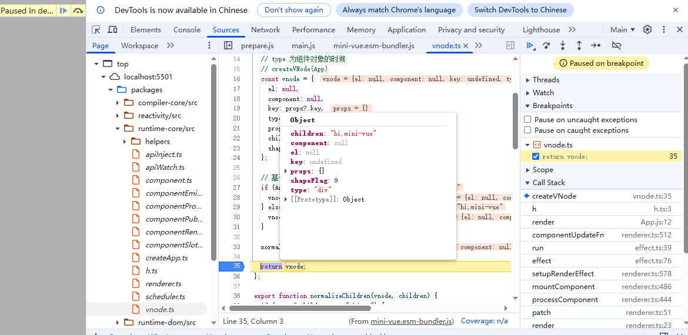
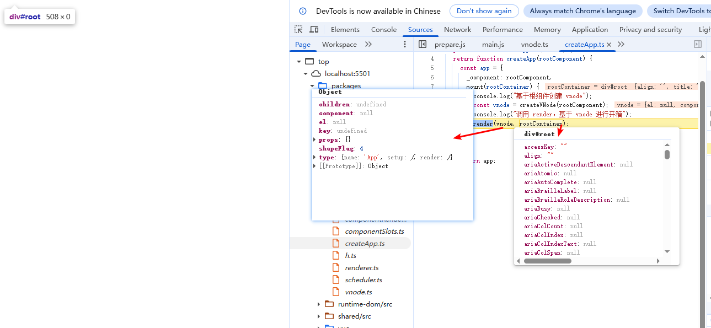
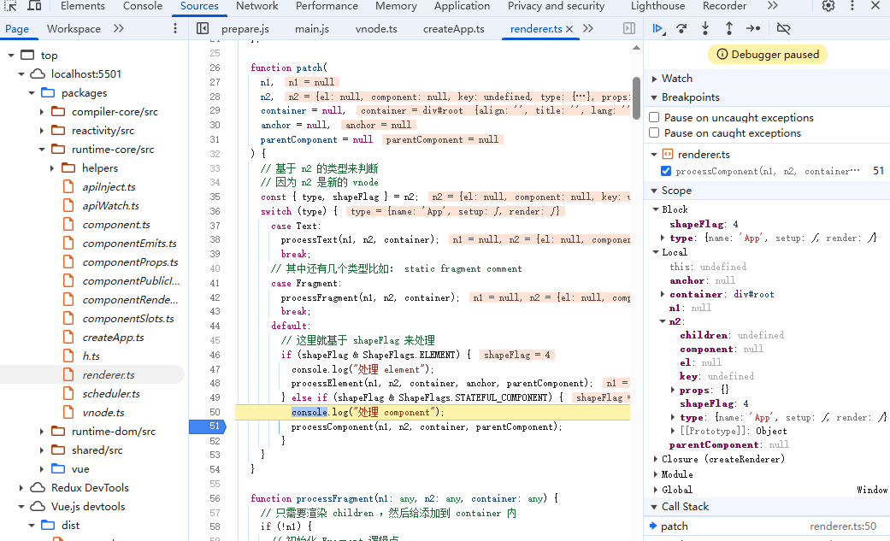

# 调用流程图


# runtime-dom

1. 基于 runtime-core 进行了所有导出
2. 提供了 createRenderer 可以自定义渲染器接口函数
3. 默认提供了一个 createApp，其提供了默认的调用 createRenderer，其返回了包含 createApp函数 的对象
4.  createAppAPI 返回了 createApp 函数，其提供了 mount 方法，使用时会调用mount方法

```
// packages\runtime-dom\src\index.ts
function createElement() {}
...

function ensureRenderer() {
  // 如果 renderer 有值的话，那么以后都不会初始化了
  return (
    renderer ||
    (renderer = createRenderer({
      createElement,
      createText,
      setText,
      setElementText,
      patchProp,
      insert,
      remove,
    }))
  );
}

export const createApp = (...args) => {
  return ensureRenderer().createApp(...args);
};

export * from "@mini-vue/runtime-core"
```

```
// packages\runtime-core\src\renderer.ts

export function createRenderer(options) {
  const {
    createElement: hostCreateElement,
    setElementText: hostSetElementText,
    patchProp: hostPatchProp,
    insert: hostInsert,
    remove: hostRemove,
    setText: hostSetText,
    createText: hostCreateText,
  } = options;

  const render = (vnode, container) => {
    console.log("调用 patch")
    patch(null, vnode, container);
  };
 
 function hostCreateElement() {...}
 function hostSetElementText(){...}
 ... 
 return {
    render,
    createApp: createAppAPI(render),
  };
}
```

```
// packages\runtime-core\src\createApp.ts
import { createVNode } from "./vnode";

export function createAppAPI(render) {
  return function createApp(rootComponent) {
    const app = {
      _component: rootComponent,
      mount(rootContainer) {
        console.log("基于根组件创建 vnode");
        const vnode = createVNode(rootComponent);
        console.log("调用 render，基于 vnode 进行开箱");
        render(vnode, rootContainer);
      },
    };

    return app;
  };
}
```

### createElement

```
function createElement(type) {
  const element = document.createElement(type);
  return element;
}
```

### createText

`createTextNode()`是 DOM 操作中用于创建文本节点的方法，它是处理文本内容的基础工具。

- Text 节点是 DOM 树中的一种节点类型
- 它只包含纯文本内容，没有标签
- Text 节点不能有子节点
- 常用于在元素中插入纯文本内容

```
return document.createTextNode(text);
```

#### 搭配 appendChild 使用

```
<div id="container"></div>

<script>
// 创建文本节点
const textNode = document.createTextNode('Hello, World!');

// 获取容器元素
const container = document.getElementById('container');

// 将文本节点插入到容器中
container.appendChild(textNode);

// 结果：<div id="container">Hello, World!</div>
</script>
```

#### 搭配 insertBefore 使用

```
假设我们有如下 HTML 结构：
<ul id="myList">
  <li>第一项</li>
  <li>第二项</li>
  <li>第三项</li>
</ul>

我们可以在第二项之前插入一个文本节点：
// 创建文本节点
const textNode = document.createTextNode('插入的文本内容');

// 获取父节点和参考节点
const list = document.getElementById('myList');
const secondItem = list.getElementsByTagName('li')[1]; // 第二项

// 插入文本节点
list.insertBefore(textNode, secondItem);
插入后的结构将是：

<ul id="myList">
  <li>第一项</li>
  插入的文本内容
  <li>第二项</li>
  <li>第三项</li>
</ul>
```

### setText

### setElementText

### patchProp

### insert

```
function insert(child, parent, anchor = null) {
  parent.insertBefore(child, anchor);
}
```

语法：

- `newNode`：要插入的节点。
- `referenceNode`：参考节点，新节点会插入到这个节点之前。如果`referenceNode`为`null`，则新节点会插入到子节点列表的末尾。

```
parentNode.insertBefore(newNode, referenceNode);
```

例子：

```
<ul id="myList">
  <li>Item 1</li>
  <li>Item 2</li>
  <li>Item 3</li>
</ul>
```

我们想在`Item 2`之前插入一个新的列表项，可以这样做：

```
// 获取父节点
var myList = document.getElementById('myList');
// 创建新节点
var newNode = document.createElement('li');
newNode.textContent = 'New Item';

// 获取参考节点
var referenceNode = myList.children[1]; // 第二个li元素，即Item 2

// 插入新节点
myList.insertBefore(newNode, referenceNode);
```

执行后，HTML结构变为：

```
<ul id="myList">
  <li>Item 1</li>
  <li>New Item</li>
  <li>Item 2</li>
  <li>Item 3</li>
</ul>
```

### remove

# runtime-core

## 初始化 Component

### 例子

```
// packages\vue\example\init-component

// index.html

<!DOCTYPE html>
<html lang="en">
<head>
    <meta charset="UTF-8">
    <meta name="viewport" content="width=device-width, initial-scale=1.0">
    <title>Document</title>
</head>
<body>


    <div id="root"></div>

    <script src="main.js" type="module"></script>

</body>
</html>

// App.js
import { h } from "../../dist/mini-vue.esm-bundler.js";

export default {
  name: "App",
  setup() {
    return {
      msg: "mini-vue",
    };
  },

  render() {
    return h("div", {}, "hi," + this.msg);
  },
};

// main.js
import { createApp } from "../../dist/mini-vue.esm-bundler.js";
import App from "./App.js";

const rootContainer = document.querySelector("#root");
createApp(App).mount(rootContainer);
```

### 关键实现

#### 入口挂载

1. 根据 runtime-dom 中，调用了 createApp 返回了 包含 mount 函数的对象
2. 调用mount 函数，把组件进行传入，其会先调用 createVNode 进行创建虚拟 DOM
3. 调用 render 函数，传入虚拟 DOM 和 父节点，其会调用 patch 函数进行对比虚拟DOM 更新真实 DOM

#### h 函数

其底层调用的是 createVnode

```
// packages\runtime-core\src\h.ts
import { createVNode } from "./vnode";
export const h = (type: any , props: any = null, children: string | Array<any> = []) => {
  return createVNode(type, props, children);
};
```

#### createVnode

##### 作用

可以创建多种类型的VNode

##### 参数

- type：节点类型，可以是元素、组件、文本等节点

  - 组件，数据是一个对象

    ```
    {
    	name: xxx,
    	setup(props, context) {},
    	render() {}
    }
    ```

  - 元素

    ```
    createVNode('div', props, children)
    ```

- props: 属性对象

- children: 数组或字符串

  - 数组：子节点列表
  - 字符串：字符

##### 执行流程

- 初始化 vnode 对象，通过 getShapeFlag 设置
- 根据是数组还是字符串设置 vnode 的 shapeFlag
- 两次处理的vnode




```
// packages\runtime-core\src\vnode.ts
export const createVNode = function (
  type: any,
  props?: any,
  children?: string | Array<any>
) {
  // 注意 type 有可能是 string 也有可能是对象
  // 如果是对象的话，那么就是用户设置的 options
  // type 为 string 的时候
  // createVNode("div")
  // type 为组件对象的时候
  // createVNode(App)
  const vnode = {
    el: null,
    component: null,
    key: props?.key,
    type,
    props: props || {},
    children,
    shapeFlag: getShapeFlag(type),
  };

  // 基于 children 再次设置 shapeFlag
  if (Array.isArray(children)) {
    vnode.shapeFlag |= ShapeFlags.ARRAY_CHILDREN;
  } else if (typeof children === "string") {
    vnode.shapeFlag |= ShapeFlags.TEXT_CHILDREN;
  }

  normalizeChildren(vnode, children);

  return vnode;
};
```

#### shapeFlag

##### 作用

Vue 3 的 `shapeFlags`是一个枚举（enum），用于在虚拟节点（VNode）中表示节点的形状（类型）信息。

##### 定义

```
export const enum ShapeFlags {
  ELEMENT = 1, // 普通 DOM 元素，如 <div>
  FUNCTIONAL_COMPONENT = 1 << 1, // 函数式组件
  STATEFUL_COMPONENT = 1 << 2, // 有状态组件（即普通组件）
  TEXT_CHILDREN = 1 << 3, // 子节点是文本
  ARRAY_CHILDREN = 1 << 4, // 子节点是数组（即多个子节点）
  SLOTS_CHILDREN = 1 << 5, // 子节点是插槽
  TELEPORT = 1 << 6, // Teleport 组件
  SUSPENSE = 1 << 7, // Suspense 组件
  COMPONENT_SHOULD_KEEP_ALIVE = 1 << 8, // 需要被 keep-alive 的组件
  COMPONENT_KEPT_ALIVE = 1 << 9, // 已经被 keep-alive 的组件
  COMPONENT = ShapeFlags.STATEFUL_COMPONENT | ShapeFlags.FUNCTIONAL_COMPONENT // 组件（有状态或函数式）
}
```

##### 位运算的使用

1. 组合标志

例如，一个组件可能有多个特征：它既是一个有状态组件（STATEFUL_COMPONENT），又有数组子节点（ARRAY_CHILDREN）。那么它的 `shapeFlag`可以表示为：

```
const shapeFlag = ShapeFlags.STATEFUL_COMPONENT | ShapeFlags.ARRAY_CHILDREN
```

2. 检查标志

检查一个 `shapeFlag`是否包含某个标志，使用按位与操作：

```
// 检查是否为有状态组件
if (shapeFlag & ShapeFlags.STATEFUL_COMPONENT) {
  // 是
}

// 检查是否有数组子节点
if (shapeFlag & ShapeFlags.ARRAY_CHILDREN) {
  // 是
}
```

##### 在VNode中的应用

在 `createVNode`函数中，会根据节点的类型和子节点的类型来设置 `shapeFlag`。

```
function createVNode(type, props, children) {
  // 根据 type 判断节点类型
  let shapeFlag = 0
  if (typeof type === 'string') {
    shapeFlag = ShapeFlags.ELEMENT
  } else if (isObject(type)) {
    shapeFlag = ShapeFlags.STATEFUL_COMPONENT
  } else if (isFunction(type)) {
    shapeFlag = ShapeFlags.FUNCTIONAL_COMPONENT
  }

  // 根据 children 判断子节点类型
  if (typeof children === 'string') {
    shapeFlag |= ShapeFlags.TEXT_CHILDREN
  } else if (Array.isArray(children)) {
    shapeFlag |= ShapeFlags.ARRAY_CHILDREN
  } else if (typeof children === 'object' && children !== null) {
    // 插槽对象
    shapeFlag |= ShapeFlags.SLOTS_CHILDREN
  }

  const vnode = {
    type,
    props,
    children,
    shapeFlag
    // ... 其他属性
  }

  return vnode
}
```

##### 在渲染器中使用

在渲染器（renderer）中，会根据 `shapeFlag`来执行不同的渲染逻辑。

例如，在 `patch`函数中：

```
function patch(n1, n2, container, anchor) {
  const { shapeFlag } = n2

  if (shapeFlag & ShapeFlags.ELEMENT) {
    // 处理元素节点
    processElement(n1, n2, container, anchor)
  } else if (shapeFlag & ShapeFlags.COMPONENT) {
    // 处理组件
    processComponent(n1, n2, container, anchor)
  } else if (shapeFlag & ShapeFlags.TEXT) {
    // 处理文本节点
    processText(n1, n2, container, anchor)
  } else if (shapeFlag & ShapeFlags.FRAGMENT) {
    // 处理 Fragment
    processFragment(n1, n2, container, anchor)
  }
  // ... 其他类型
}
```

#### render

##### 调试截图



##### 关键实现

其是在`runtime-dom`中默认指定的，其实现是在`createRenderer`中;

其会调用`patch`函数。

```
// packages\runtime-core\src\renderer.ts
// packages\runtime-core\src\renderer.ts

export function createRenderer(options) {
  const {
    createElement: hostCreateElement,
    setElementText: hostSetElementText,
    patchProp: hostPatchProp,
    insert: hostInsert,
    remove: hostRemove,
    setText: hostSetText,
    createText: hostCreateText,
  } = options;

  const render = (vnode, container) => {
    console.log("调用 patch")
    patch(null, vnode, container);
  };
 
 function hostCreateElement() {...}
 function hostSetElementText(){...}
 ... 
 return {
    render,
    createApp: createAppAPI(render),
  };
}
```

#### patch

##### 调试截图



##### 关键实现

```

```


